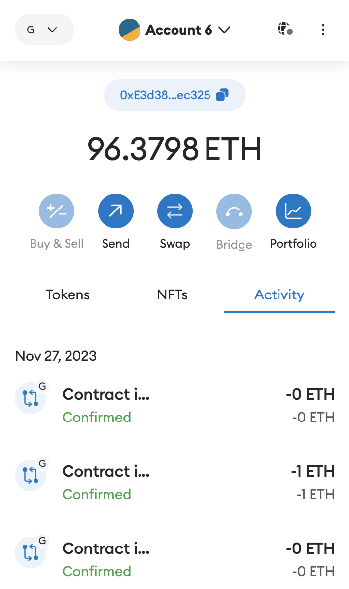
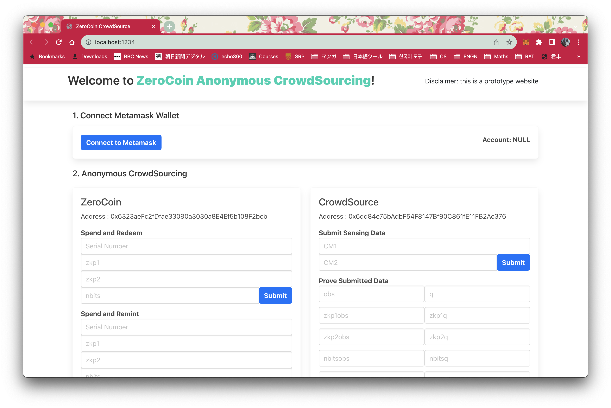
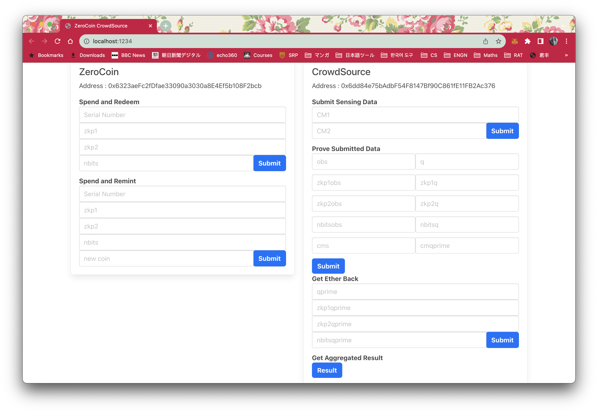

# Client DApp
## Dependencies
- [parcel](https://parceljs.org/)
- web3@1.10.0
- [MetaMask](https://metamask.io/) wallet

## Instruction
```
npm run start
```

## Walkthrough

**Prerequisite**
The requester needs to deploy the smart contracts first and share the contract artefacts (`json` files) from the `build` directory with workers. 

Workers can connect to this DApp interface with their MetaMask account, and use it to complete the task. The account needs to have sufficient cryptocurrency in it.


**Home page**


The page displays the interface to the main smart contracts `CrowdSource` and `ZeroCoin`. Users can interact with the smart contracts through on-chain transactions following the anonymous crowdsourcing protocol described in the paper.


**Step 1**
Connect to one of your MetaMask wallet account.

**Step 2**
Follow the protocol to complete anonymous crowdsourcing.

## Functionalities



**Crowdsource**
- Data Submission with Staking (*Submit Sensing Data*)
- Data Verification (*Prove Submitted Data*)
- Stake Refund (*Get Ether back*)
- Data Aggregation (*Get Aggregated Result*) **Note** This step only by requester

**ZeroCoin**
- Reward Claiming (*Spend and Redeem* and *Spend and Remint*)